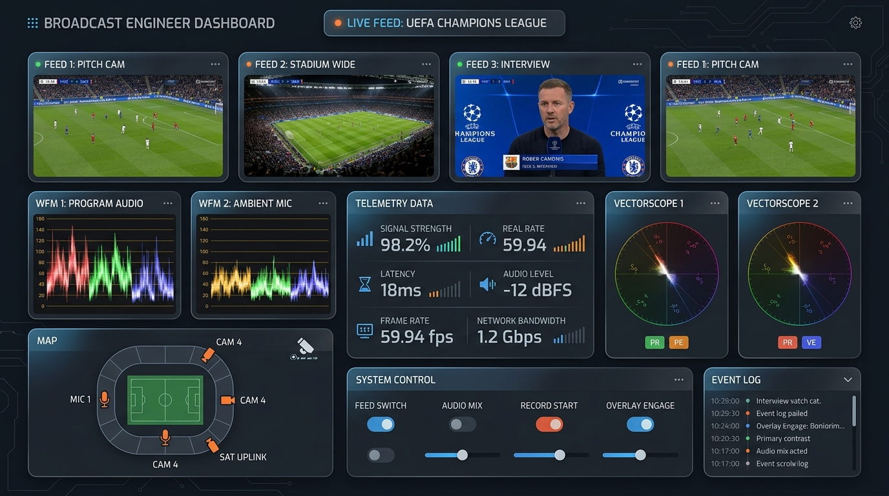
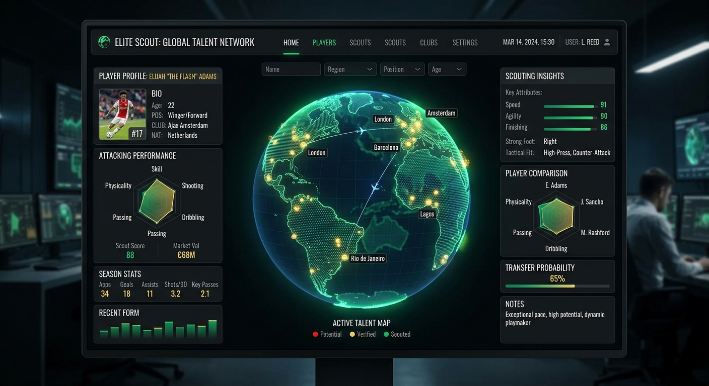

# ⚽ FIFA Hub: Next-Gen World Cup Platform


**FIFA Hub** is a cutting-edge, full-stack sports platform designed for the FIFA World Cup 2026. It combines high-fidelity match simulations, an immersive live broadcast experience, and advanced data-driven scouting—all powered by the Gemini AI API.

## 🚀 Key Features

### 📡 Global Broadcast & CDN Observability

- **LiveTV Module**: A professional broadcast engineer interface featuring ultra-low latency streams.
- **Stream Intelligence Overlay**: Real-time technical telemetry including bitrate, jitter, latency, and packet loss.
- **CDN Orchestration**: Dynamic handoff visualization across global edge nodes (Asia, Europe, US).

### 🔍 AI-Powered Scouting Terminal

- **Gemini Scouting Reports**: Generate deep tactical analyses for any national team, including formations, playing styles, and key player heatmaps.
- **Player Comparison Engine**: Head-to-head tactical verdicts comparing world-class athletes.
- **Network Flow Monitor**: A D3-based interactive node graph visualizing the data streams between global scouting servers.

### 🏟️ Immersive Stadium Design
The platform's UI is built on a **"Stadium-First"** aesthetic:
- **Night-Mode Pitch Palette**: High-contrast slate and rose color scheme mimicking a floodlit arena.
- **Glass-Morphism Layers**: Sophisticated translucent panels that prioritize data density without sacrificing elegance.
- **Broadcast HUD**: Heads-up displays that make every view feel like a command center in a modern stadium.

### ⚽ Intelligent Match Simulator
- **Procedural Commentary**: Real-time event feeds powered by local high-fidelity engines and Gemini.
- **Tactical Pitch Visualizer**: Live formations that update dynamically based on team strategies.
- **Real-Time Notification System**: Integrated the browser's native **Notification API** to alert users with instant desktop/mobile push notifications whenever a goal is scored or a match concludes.
- **Man of the Match Card**: A dynamic, FUT-style gold card generated at full-time calculating player ratings, key match stats (goals, shots on target, passes, tackles), and custom tactical MVP summaries based on simulation events.

### 💳 Secure Payment Gateways
- **Stripe Checkout**: Integrated real-world payment processing for premium upgrades. Supports dynamic checkout sessions and config retrieval from the server.
- **bKash & BohudurPay Portal**: Full end-to-end payment simulation for regional tournament passes and merchandise.
- **Dynamic Credentials**: Interactive terminal for managing sandbox API keys and intent selection.
- **Transaction History**: Real-time logging of payment events and verification states.

### 📱 Mobile Web App & PWA Branding
- **Custom Launcher Icon**: A highly polished, golden minimalist football launcher logo that appears on your phone's home screen when installed.
- **Standalone Mobile Experience**: Configured with a `manifest.json` and Apple mobile web app capability for a seamless full-screen app experience on iOS and Android devices, without standard browser UI bars.

## 🛠️ Technical Stack

- **Framework**: [React 18](https://react.dev/) with [Vite](https://vitejs.dev/) for lightning-fast HMR and builds.
- **Styling**: [Tailwind CSS](https://tailwindcss.com/) for a modular, responsive design system.
- **Backend**: Node.js & Express for proxying API requests and handling secure AI logic.
- **AI Engine**: [Google Gemini API](https://ai.google.dev/) for dynamic content generation (Scouting, News, Quizzes).
- **Visualization**: [D3.js](https://d3js.org/) for network graphs and [Recharts](https://recharts.org/) for telemetry analytics.
- **Animations**: [Framer Motion](https://www.framer.com/motion/) (motion/react) for fluid transitions.

## 📦 Installation & Setup

1. **Clone and Install**:
   ```bash
   npm install
   ```

2. **Environment Configuration**:
   Create a `.env` file in the root and add your Gemini API Key:
   ```env
   GEMINI_API_KEY=your_actual_key_here
   ```

3. **Development Mode**:
   ```bash
   npm run dev
   ```

4. **Production Build**:
   ```bash
   npm run build
   npm start
   ```

## 📈 Platform Observability
The integrated **Network Dynamics** dashboard provides 100% transparency into the platform's infrastructure, ensuring that global broadcast streams remain nominal even during peak World Cup traffic.

---
*Developed for the Future of Football. Powered by AI.*
